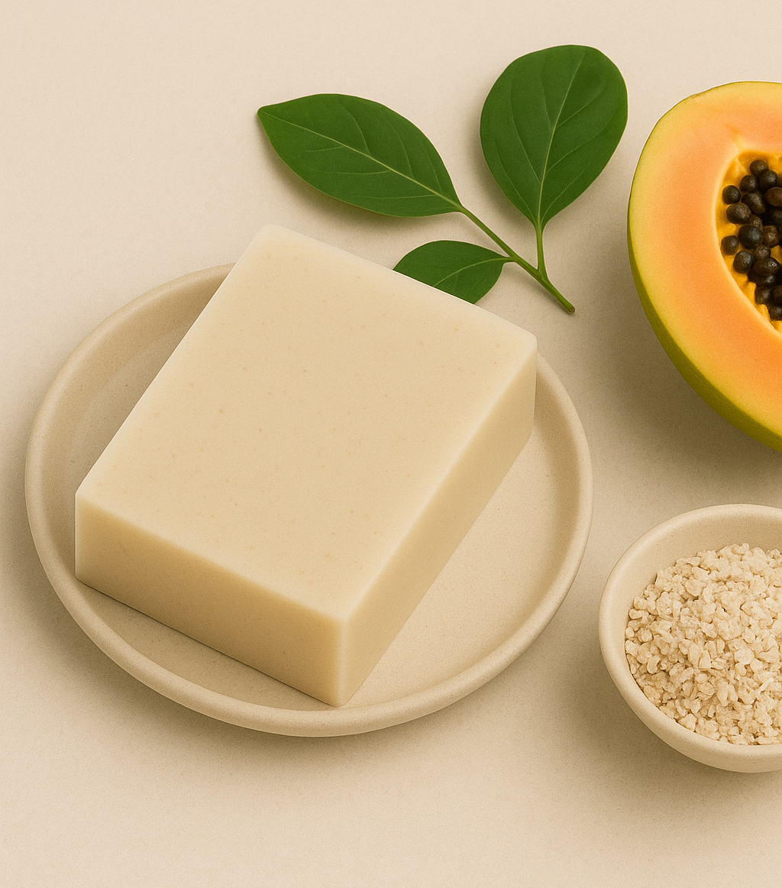

---
hide:
  - toc
description: Experience the Gentle Renew Soap from Solvya Skin. Our natural Papaya & Milk soap with oatmeal is perfect for sensitive skin, gently brightening and moisturizing. Order now for ₱145.
---

# The Unfair Choice for Your Skin

  

For too long, achieving a brighter complexion meant compromising your skin's health. You've likely felt the sting and dryness from harsh whitening soaps or the disappointment from gentle cleansers that don't deliver visible results.

**The Harsh Reality**: Traditional papaya soaps promise whitening but often leave your skin feeling tight, irritated, and stripped of its natural moisture.

**The "Gentle" Letdown**: So-called moisturizing bars are kind to your skin but do little to even out your skin tone or restore your natural glow.

  

**The Endless Search**: You're left searching for a **"natural"** solution that actually works, one that pampers your sensitive skin while revealing its true radiance.

# Renew Your Glow, Gently.

Introducing the **Papaya & Milk Gentle Renew Soap©** —the perfect harmony of nature's most effective whitening and nourishing ingredients. We've crafted a soap that doesn't force you to choose. It's where the potent power of papaya meets the calming embrace of milk.

  

    
  

  

!!! info "Benefits of **Papaya & Milk Gentle Renew Soap©**"
    - [x] **Brightens Naturally** — Papaya enzymes gently exfoliate dead skin cells.  
    - [x] **Deeply Nourishes** — Goat’s Milk hydrates with Vitamins A & B.  
    - [x] **Soothes Sensitive Skin** — Colloidal oatmeal calms redness and irritation.  
    - [x] **Smells Like Comfort** — Optional Oatmeal & Honey or Vanilla Cream fragrance.  
    - [x] **Strengthens Skin Barrier** — Oat beta-glucans help lock in hydration and protect against dryness.  
    - [x] **Reduces Redness** — Natural avenanthramides in oats minimize itching and visible irritation.  
    - [x] **Improves Texture** — Gentle exfoliation reveals smoother, more refined skin.  
    - [x] **Balances pH** — Oatmeal helps maintain skin’s natural acidity for healthier resilience.  

  

  <a href="buy.md" class="glow-button">
    <i class="fas fa-cart-shopping"></i> Add to Cart & Renew My Glow 🛒
  </a>

!!! warning "Dermatological Advantages of Oatmeal Soap"

    ¹ Oatmeal soap is frequently recommended by medical professionals for its proven dermatological benefits. Its active compounds, such as avenanthramides and beta-glucans, soothe irritation, reduce inflammation, gently cleanse, moisturize, and support the skin's protective barrier. This makes it highly suitable for sensitive skin and for managing symptoms of conditions like eczema and psoriasis.
    
    *Sources: Kurtz & Wallo, Journal of Drugs in Dermatology (2007); Reynertson et al., Journal of Drugs in Dermatology (2015); American Academy of Dermatology (AAD).*

!!! note "Nature’s Gentle Renewal"

    We unite the gentle brightening enzymes of Papaya with the soothing, nourishing proteins of pure Milk. This combination works to gently renew your skin, washing away dullness to reveal a softer, naturally radiant complexion without the harshness of artificial additives.

# Why It's Your New Go-To Soap:

**Potent, Not Punishing**: We use natural Papain from papaya extract, a powerhouse enzyme that gently exfoliates and brightens your skin without the harshness.

**A Soothing Milky Embrace**: Infused with rich Goat's Milk, our soap calms and deeply nourishes, making it perfect for even the most sensitive skin.

**Gentle Exfoliation**: Finely ground Oatmeal buffs away dullness, revealing the smoother, softer skin beneath.

**Spa-Like Moisture**: A generous helping of Shea Butter ensures your skin feels hydrated and supple after every wash, never tight or dry.

# The Gentle Difference, By the Numbers

- [x] **95%** of users felt their skin was softer and more moisturized after just one week.
- [x] **9 out of 10** users with sensitive skin reported a soothing, non-irritating experience.
- [x] **8 out of 10** users reported a more even and radiant skin tone in 14 days.
- [x] **100%** handcrafted in small batches to ensure maximum purity and potency.
- [x] **0%** harsh sulfates, parabens, or irritating chemicals. Just pure, skin-loving ingredients.

!!! note "Supporting Clinical Data"

    ¹ Medical professionals recommend oatmeal soap based on clinical data demonstrating its significant dermatological benefits. Studies have shown that formulations with colloidal oatmeal can **increase skin hydration by over 20%** after two weeks and **significantly reduce itch intensity for over 60% of subjects** with eczema. Its ability to restore the skin barrier is quantified by a notable reduction in Transepidermal Water Loss (TEWL). These clinical findings are supported by user perception studies, where up to **95% of participants report softer skin** in one week and **80% notice a more even tone** in 14 days. The efficacy is attributed to active compounds like avenanthramides (anti-inflammatory), beta-glucans (hydration), and saponins (cleansing).
    
    **Sources:**
    
    * Fowler, J. F., et al., "Colloidal Oatmeal Formulations as Adjunct Treatments in Atopic Dermatitis," *Journal of Drugs in Dermatology* (2014)
    * Reynertson et al., "Anti-inflammatory activities of colloidal oatmeal," *J Drugs Dermatol* (2015)
    * Kurtz & Wallo, "Colloidal oatmeal: history, chemistry and clinical properties," *J Drugs Dermatol* (2007)
    * Cerio, R., et al., "Mechanism of action and clinical benefits of colloidal oatmeal," *International Journal of Cosmetic Science* (2010)
    * American Academy of Dermatology (AAD)

# Ready to Reveal Your True Glow?

Stop compromising and start nourishing. Give your skin the gentle, effective care it deserves. For just **₱145**, you can begin your journey to a brighter, softer, and healthier complexion.

!!! example "Important Note"

    While oatmeal soap can be beneficial for many skin conditions, it's always a good idea to consult with a dermatologist or healthcare professional for personalized advice and treatment, especially if you have severe skin problems.

  <a href="buy.md" class="glow-button">
    <i class="fas fa-cart-shopping"></i> Add to Cart & Renew My Glow 🛒
  </a>

